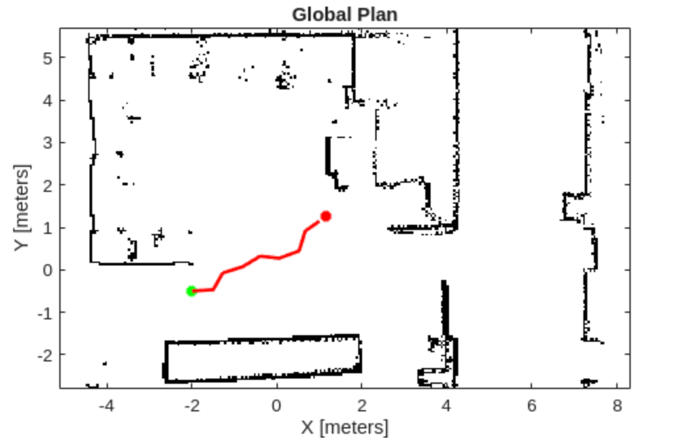
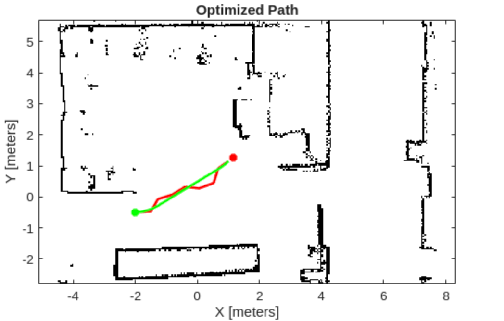
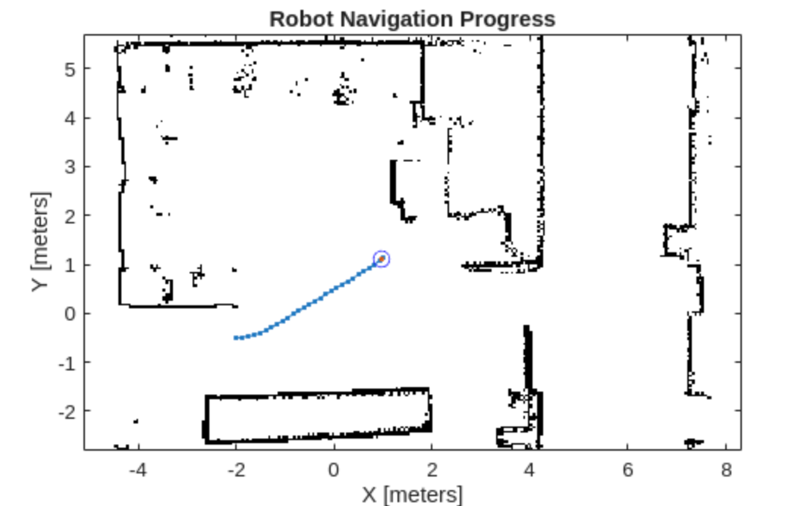

# TEB/MPC based navigation of TurtleBot3 (MATLAB ↔ ROS2)

**Repository:** teb-matlab-ros2

**Purpose**

This repository contains everything to reproduce the project you described: a ROS2 (Humble) TurtleBot3 Gazebo simulation integrated with MATLAB for global planning (RRT/PRM), a TEB-based local planner, visualization, and a ROS↔MATLAB bridge (publishers/subscribers and callbacks). The repo includes starter MATLAB code, a `PoseHandle` class, mapping utilities, planner scripts, visualizers, and a comprehensive `README.md` with step-by-step instructions.

Find more info about TEB [here](https://wiki.ros.org/teb_local_planner).

---

## Repo structure

```
/turtlebot3-matlab-navigation
├── README.md
├── ros2_ws
│   └── src                  # merge this with your existing workspace which has all the required pkgs as mentioned in the following steps
├── matlab
│   ├── Nav2.mlx             # the interactive matlab script/section wise control
│   ├── PoseHandle.m         # helper to publish pose messages
│   ├── rst_lab_cropped.pgm  # map file (copyrighted by RST Lab. TU Dortmund)
└── readme_files
    ├── xx                   # image
    └── xx                   # video
```

---

## What's included

- ROS2, gazebo, rviz2 being used for the simulation and MATLAB is used to run the control algorithm including the processing of different global and local mapping approaches.
- MATLAB scripts for ROS 2 ↔ MATLAB communication (publisher/subscriber). Uses ROS Toolbox (MATLAB) `ros2` interface.
- `PoseHandle` class to hold and visualize robot pose and global goal.
- Map loader that converts the provided `rst_lab_cropped.pgm` into a `binaryOccupancyMap` and aligns its axes correctly for MATLAB plotting.
- Implementations/wrappers for `plannerPRM` and `plannerRRT` and visualizers to plot the computed paths.
- TEB local planner script that calls `optimizePath` and constructs a `controllerTEB` (or a custom TEB controller if MATLAB version lacks direct object), publishes `/cmd_vel` to drive the robot.
- `Nav2.mlx` shows a full run: connect to ROS 2, set goal, run global planner, optimize, execute local planner, and visualize.

---

## Quickstart (summary)

**Prerequisites**
- Ubuntu 22.04, ROS 2 Humble with desktop and Gazebo support installed.
- MATLAB R2022b or later with the following toolboxes:
  - Robotics System Toolbox
  - ROS Toolbox (ROS 2 support)
  - Navigation Toolbox (plannerPRM, plannerRRT, optimizePath)
  - (optional) Optimization Toolbox
- `colcon` and build tools for ROS 2.

**1. Install TurtleBot3 & dependencies (on Linux)**

Execute the commands manually to install the required pkgs:

```bash
sudo apt update
sudo apt install -y ros-humble-nav* ros-humble-cartographer* ros-humble-rmw-cyclonedds-cpp

# Clone turtlebot3 repos into your workspace
cd ~/catkin_ws/src/
git clone https://github.com/ROBOTIS-GIT/turtlebot3_simulations.git -b humble-devel
git clone https://github.com/ROBOTIS-GIT/turtlebot3.git -b humble-devel
git clone https://github.com/ROBOTIS-GIT/turtlebot3_msgs.git -b humble-devel
git clone https://github.com/ROBOTIS-GIT/DynamixelSDK.git -b humble-devel

cd ~/catkin_ws && colcon build
source ~/catkin_ws/install/setup.bash
# set model
echo "export TURTLEBOT3_MODEL=waffle" >> ~/.profile

# Merge the ros2_ws/src (provided in this repo) with your local workspace catkin_ws/src as it included the required launch files and map for the project.

# Build again
cd ~/catkin_ws && colcon build

# Start simulation (After successful build)
ros2 launch turtlebot3_gazebo turtlebot3_rst_lab.launch.py

# Start navigation (launches all the required nodes)
ros2 launch turtlebot3_navigation2 navigation2_rst_lab.launch.py use_sim_time:=True
```

**2. Setup MATLAB**

- Open MATLAB and add the `matlab/` folder to the path.
- Make sure MATLAB's ROS 2 node connects to the same DDS domain as the ROS2 simulation (CycloneDDS default). If needed, set `RMW` env variables in your shell before launching MATLAB (or launch MATLAB from a shell where you source ROS setup).
- Setting same ROS_DOMAIN_ID is really important to sync the connection between MATLAB and ROS_MASTER.

**3. Run the demo**

From MATLAB:

```matlab
open('matlab/Nav2.mlx')
```

This MATLAB script has sections and easier to run:
- connects to the ROS2 network,
- subscribes to `/odom`, `/goal_pose`,
- publishes to `/cmd_vel`,
- loads the `rst_lab_cropped.pgm` map,
- computes a global path (RRT or PRM),

- optimizes it (TEB), and

- executes and visualizes motion.


---

## Important implementation notes

- **Coordinate frames:** ROS (Gazebo) uses `x-forward`, `y-left`, `z-up`. The `.pgm` map axis and MATLAB axes can be flipped — the helper `goalHandle2goalPose.m` ensures conversions are correct.
- **ROS↔MATLAB transports:** Use MATLAB ROS Toolbox `ros2node`, `ros2publisher`, `ros2subscriber` and message helpers like `ros2message` for Twist and PoseStamped messages.
- **Replanning:** The local planner monitors feasibility; if `optimizePath` fails or local controller cannot follow, the script triggers `global_planner.m` to produce a new path.
- **Timing / sim time:** Use `use_sim_time := true` in the ROS2 navigation launch and ensure MATLAB respects simulated time if you want playback control.

---

## License

This project skeleton is released under the MIT License. All rights are reserved by RST Lab. at TU Dortmund.

---

